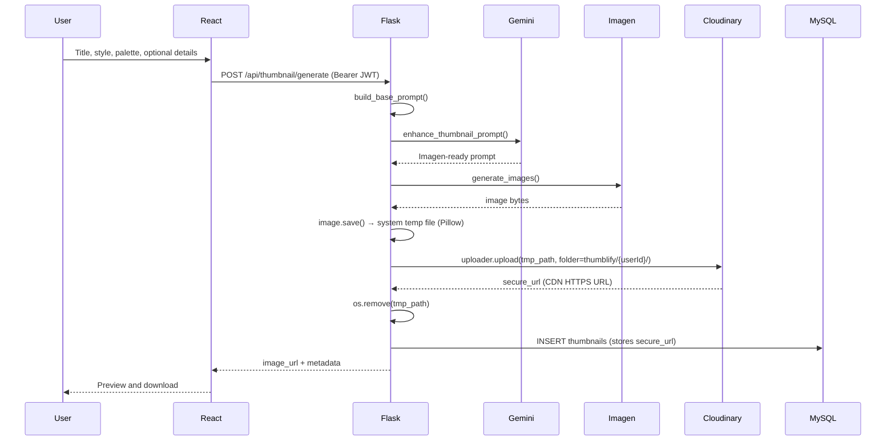

# Thumblify

AI-powered YouTube thumbnail generator. Describe your video topic, pick a style and color palette, and get a ready-to-use thumbnail with title (and optional subtitle) baked into the image.

**Stack:** React (Vite) · Flask · MySQL · Google Gemini (prompt engineering) · Vertex AI Imagen · Cloudinary

**Live backend:** `https://thumblify-zcvr.onrender.com`
**Live frontend:** https://thumblifyweb.vercel.app/

## Screenshots

### Landing page


### Generate


### My Generations


## Features

- **AI thumbnail generation** — Vertex AI Imagen (`imagen-4.0-generate-001`) with aspect ratios `16:9`, `1:1`, `9:16`
- **Smart prompts** — Gemini enhances your inputs with topic-relevant props, icons, and composition
- **10 visual styles** — Bold & Graphic, Minimalist, Photorealistic, Illustrated, Tech/Futuristic, Cyberpunk, Gaming, Horror / Dark, Retro / Vaporwave, Corporate
- **16 color palettes** — Vibrant, Sunset, Ocean, Cyberpunk, Gaming, Gold, and more
- **Auth** — Register, login, JWT-protected routes (1-day token expiry)
- **My Generations** — List, download, and open saved thumbnails in read-only Generate view
- **Marketing site** — Home, pricing, features, testimonials, contact

## Tech stack

| Layer | Technologies |
|--------|----------------|
| Frontend | React 19, Vite, Tailwind CSS 4, Motion, React Router, Sonner |
| Backend | Flask, Flask-CORS, Flask-JWT-Extended, Flask-MySQLdb, Gunicorn |
| AI | `google-genai` (Gemini) · `google-cloud-aiplatform` / Vertex AI Imagen |
| Database | MySQL (local or [Aiven](https://aiven.io/) with SSL) |
| Image storage | **Cloudinary** — generated thumbnails are uploaded to the Cloudinary CDN; the `secure_url` is stored in MySQL |
| Image I/O | **Pillow** (required by Vertex AI SDK for writing temp PNGs before upload) |

## Project structure

```
Thumblify/
├── backend/
│   ├── app.py                      # App factory, Vertex init, Cloudinary init, blueprint registration
│   ├── config/
│   │   ├── db.py                   # MySQL (Aiven SSL in production)
│   │   ├── cloudinary_config.py    # Cloudinary SDK initialisation from env vars
│   │   ├── paths.py                # Aspect-ratio size map
│   │   └── ca.pem                  # Aiven CA cert (for SSL DB connection)
│   ├── routes/
│   │   ├── register.py
│   │   ├── login.py
│   │   ├── logout.py
│   │   ├── get_user.py
│   │   ├── generate_thumbnail.py   # POST /api/thumbnail/generate → uploads to Cloudinary
│   │   ├── list_thumbnails.py      # GET  /api/thumbnail/list
│   │   └── get_thumbnail.py        # GET  /api/thumbnail/:id
│   ├── services/
│   │   ├── prompt_engineer.py      # Gemini prompt enhancement
│   │   └── save_thumbnail.py       # INSERT thumbnail metadata (cloudinary URL)
│   ├── prompts/
│   │   └── thumbnail_prompts.py    # Style & color prompt maps
│   ├── utils/
│   │   ├── auth.py                 # get_jwt_user_id()
│   │   └── thumbnail_db.py         # Row → JSON helper
│   ├── key.json                    # GCP service account (gitignored)
│   ├── .env.example
│   └── requirements.txt
├── frontend/
│   ├── public/                     # Screenshots & static assets
│   └── src/
│       ├── pages/                  # Home, Generate, MyGenerations, Login, Contact
│       ├── components/
│       ├── sections/
│       └── Context/
└── README.md
```

## How it works



Generated images are uploaded to Cloudinary under the `thumblify/{userId}/` folder. Cloudinary's global CDN serves them directly via `secure_url` (HTTPS). No files are stored on the server.

## Prerequisites

- Node.js 18+ and npm
- Python 3.11+
- MySQL (local or cloud e.g. Aiven)
- Google Cloud project with **Vertex AI** enabled + service account JSON (`key.json`)
- **Google AI Studio** API key for Gemini ([aistudio.google.com](https://aistudio.google.com))
- **Cloudinary** account — free tier is sufficient ([cloudinary.com](https://cloudinary.com))

## Setup

### 1. Clone and install

```bash
git clone https://github.com/ali-husnain00/thumblify.git
cd thumblify

cd frontend && npm install
cd ../backend && pip install -r requirements.txt
```

### 2. Environment variables

```bash
cd backend
copy .env.example .env   # Windows
# cp .env.example .env   # macOS / Linux
```

| Variable | Purpose |
|----------|---------|
| `GEMINI_API_KEY` | Google AI Studio — prompt engineering |
| `JWT_SECRET_KEY` | Signs login tokens |
| `HOST` | MySQL host |
| `USER` | MySQL user |
| `PASSWORD` | MySQL password |
| `DB_NAME` | Database name |
| `DB_PORT` | MySQL port (required for Aiven, e.g. `12345`) |
| `CLOUDINARY_CLOUD_NAME` | Your Cloudinary cloud name (Dashboard → Settings) |
| `CLOUDINARY_API_KEY` | Cloudinary API key |
| `CLOUDINARY_API_SECRET` | Cloudinary API secret |

For **Aiven**, place the provided `ca.pem` in `backend/config/ca.pem` (used by `config/db.py` for SSL).

### 3. Google Cloud (Vertex AI)

1. Create a service account with Vertex AI access.
2. Download the JSON key → `backend/key.json` (**never commit**).
3. Update `vertexai.init(project=..., location=...)` in `app.py` if needed.

**Production (e.g. Render):** mount the key as a secret and point `GOOGLE_APPLICATION_CREDENTIALS` to that path (see comment in `app.py`).

### 4. Database

```sql
CREATE DATABASE IF NOT EXISTS Thumblify;
USE Thumblify;

-- users table from your auth setup (register route)

CREATE TABLE thumbnails (
    id INT AUTO_INCREMENT PRIMARY KEY,
    user_id INT NOT NULL,
    title VARCHAR(255) NOT NULL,
    style VARCHAR(64) NOT NULL,
    color_scheme VARCHAR(32) NOT NULL,
    aspect_ratio VARCHAR(8) NOT NULL,
    additional_details TEXT NULL,
    prompt_used TEXT NOT NULL,
    image_url VARCHAR(512) NOT NULL,
    created_at TIMESTAMP DEFAULT CURRENT_TIMESTAMP,
    FOREIGN KEY (user_id) REFERENCES users(id) ON DELETE CASCADE
);
```

### 5. Run locally

**Backend** (`backend/`):

```bash
python app.py
```

→ `http://127.0.0.1:5000`

**Frontend** (`frontend/`):

```bash
npm run dev
```

→ `http://localhost:5173`

Update API URLs in `frontend/src` if not using Render (see [Deployment](#deployment)).

## API reference

| Method | Endpoint | Auth | Handler |
|--------|----------|------|---------|
| GET | `/` | No | Health check |
| POST | `/api/register` | No | `routes/register.py` |
| POST | `/api/login` | No | `routes/login.py` |
| POST | `/api/logout` | No | `routes/logout.py` |
| GET | `/api/user` | JWT | `routes/get_user.py` |
| POST | `/api/thumbnail/generate` | JWT | `routes/generate_thumbnail.py` |
| GET | `/api/thumbnail/list` | JWT | `routes/list_thumbnails.py` |
| GET | `/api/thumbnail/:id` | JWT | `routes/get_thumbnail.py` |

> **Note:** The `/uploads/<path>` static-file route has been removed. Images are now served directly from Cloudinary's CDN via the `image_url` field returned by the API.

## Frontend routes

| Path | Description |
|------|-------------|
| `/` | Marketing home |
| `/generate` | Create thumbnail |
| `/generate/:id` | View saved thumbnail (read-only) |
| `/my-generations` | Gallery + download |
| `/login` | Sign in / register |
| `/contact` | Contact |

## Deployment

### Backend (Gunicorn)

`requirements.txt` includes `gunicorn`, `Pillow`, and `cloudinary`. Example:

```bash
cd backend
gunicorn app:app --bind 0.0.0.0:$PORT
```

On **Render** (or similar):

- Set all `.env` variables in the dashboard (including the three `CLOUDINARY_*` vars).
- Add `key.json` as a secret file; set `GOOGLE_APPLICATION_CREDENTIALS` accordingly.
- Ensure `config/ca.pem` is present if using Aiven SSL.
- **No persistent disk needed** — images are uploaded to Cloudinary and served from its CDN; the temp file is deleted immediately after upload.

### Frontend (Vercel)

The frontend is deployed on **Vercel** at https://thumblifyweb.vercel.app/

Vercel serves static files and doesn't know about client-side routes by default — refreshing any page other than `/` returns a 404. The fix is a `vercel.json` at the root of `frontend/` that rewrites all paths to `index.html`:

```json
{
  "rewrites": [
    { "source": "/(.*)", "destination": "/index.html" }
  ]
}
```

This file is already included in `frontend/vercel.json`. Deploy steps:

1. Push `frontend/` to GitHub.
2. Import the repo on [vercel.com](https://vercel.com), set **Root Directory** to `frontend`.
3. Vercel auto-detects Vite — no extra build config needed.
4. Set `VITE_API_URL` env var in Vercel dashboard if you switch to environment-based API URLs.

Production build (local check):

```bash
cd frontend
npm run build
```

API calls are currently pointed at `https://thumblify-zcvr.onrender.com` in:

- `src/Context/Context.jsx`
- `src/pages/Login.jsx`
- `src/pages/Generate.jsx`
- `src/pages/MyGenerations.jsx`

For local dev against `localhost:5000`, change those URLs or introduce a `VITE_API_URL` env variable.

## Troubleshooting

| Error | Fix |
|-------|-----|
| `Token has expired` | Log in again (JWT expires after 1 day) |
| `PIL module is required for saving...` | `pip install Pillow` or redeploy after updating `requirements.txt` |
| `Table 'thumbnails' doesn't exist` | Run the SQL schema above |
| Push blocked for `key.json` | Never commit GCP keys; revoke and rotate if leaked |
| `cloudinary.exceptions.AuthorizationRequired` | Check `CLOUDINARY_CLOUD_NAME`, `CLOUDINARY_API_KEY`, `CLOUDINARY_API_SECRET` in `.env` |
| `Must supply cloud_name` | Cloudinary env vars are missing or `.env` was not loaded — ensure `load_dotenv()` runs before the import of `config.cloudinary_config` |

## Security

- Never commit `backend/key.json` or `backend/.env`.
- Revoke GCP keys that were ever pushed to GitHub.
- Keep `CLOUDINARY_API_SECRET` out of version control — treat it like a password.
- Use a strong `JWT_SECRET_KEY` in production.
- Image URLs stored in the database are now Cloudinary HTTPS CDN URLs — no hardcoded `localhost` paths.

## Scripts

```bash
# Frontend
npm run dev
npm run build
npm run preview

# Backend (development)
python app.py
```
