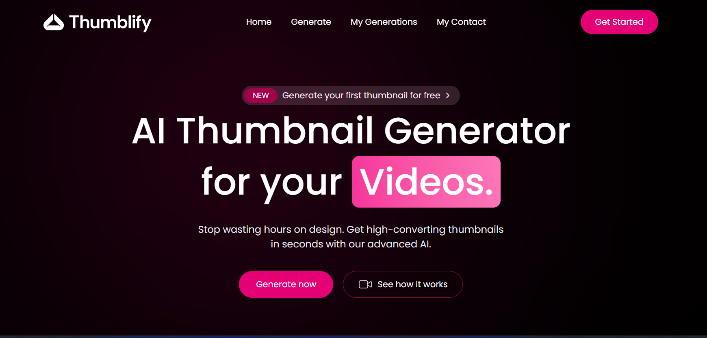
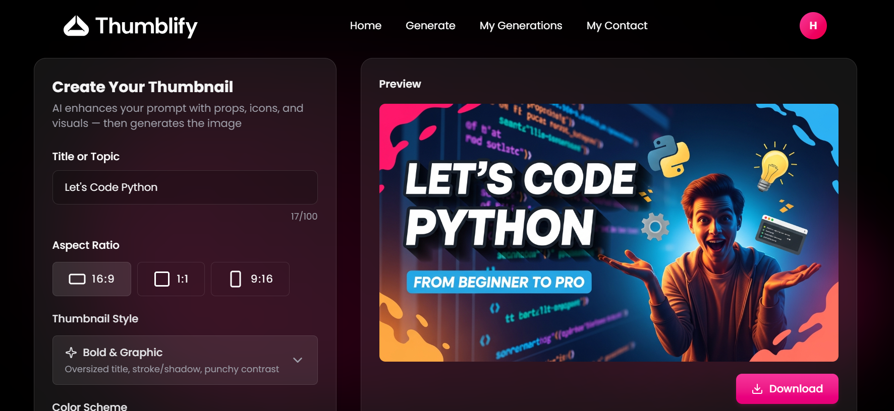
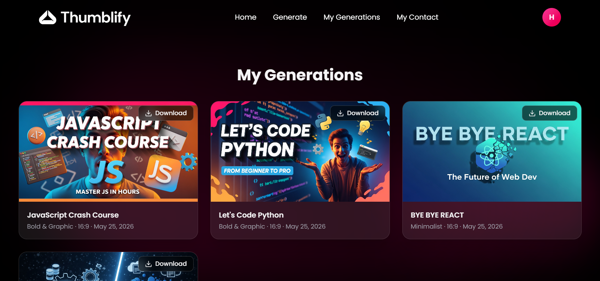
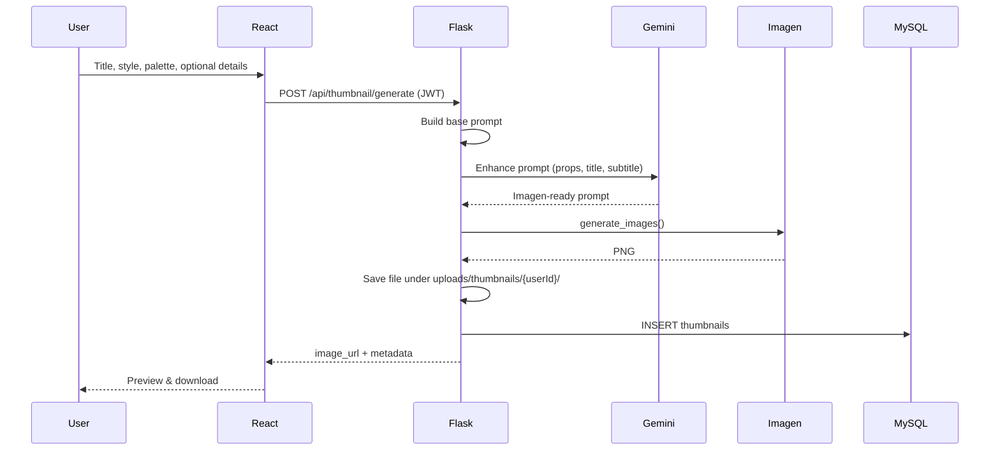

# Thumblify

AI-powered YouTube thumbnail generator. Describe your video topic, pick a style and color palette, and get a ready-to-use thumbnail with title (and optional subtitle) baked into the image. Built with React, Flask, Google Gemini (prompt engineering), and Vertex AI Imagen.

## Screenshots

### Landing page


### Generate


### My Generations


## Features

- **AI thumbnail generation** — Vertex AI Imagen 4 with aspect ratios `16:9`, `1:1`, and `9:16`
- **Smart prompts** — Google AI Studio (Gemini) expands your inputs with topic-relevant props, icons, and composition (no hex codes rendered as text)
- **10 visual styles** — Bold & Graphic, Minimalist, Photorealistic, Illustrated, Tech/Futuristic, Cyberpunk, Gaming, Horror / Dark, Retro / Vaporwave, Corporate
- **16 color palettes** — Vibrant, Sunset, Ocean, Cyberpunk, Gaming, Gold, and more
- **User accounts** — Register, login, JWT-protected API
- **My Generations** — Grid of saved thumbnails, download, open any item in the editor view
- **Marketing site** — Home, pricing, features, testimonials, contact

## Tech stack

| Layer | Technologies |
|--------|----------------|
| Frontend | React 19, Vite, Tailwind CSS 4, Motion, React Router, Sonner |
| Backend | Flask, Flask-CORS, Flask-JWT-Extended, Flask-MySQLdb |
| AI | `google-genai` (Gemini 2.0 Flash) for prompts, Vertex AI Imagen for images |
| Database | MySQL |

## Project structure

```
Thumblify/
├── backend/
│   ├── app.py                 # Flask app & thumbnail API
│   ├── config/db.py           # MySQL connection
│   ├── routes/                # Auth + thumbnail blueprints, uploads
│   ├── utils/                 # JWT helper, thumbnail row mapping
│   ├── config/paths.py        # Upload folders & aspect ratios
│   ├── services/
│   │   ├── prompt_engineer.py # Gemini prompt enhancement
│   │   └── save_thumbnail.py  # Persist metadata to MySQL
│   ├── prompts/
│   │   └── thumbnail_prompts.py
│   ├── uploads/thumbnails/    # Generated PNGs (per user id)
│   ├── key.json               # GCP credentials (local only, gitignored)
│   ├── .env.example
│   └── requirements.txt
├── frontend/
│   ├── public/                # Static assets & README screenshots
│   └── src/
│       ├── pages/             # Home, Generate, MyGenerations, Login, Contact
│       ├── components/
│       ├── sections/            # Marketing sections
│       └── Context/           # Auth state
└── README.md
```

## How it works



## Prerequisites

- **Node.js** 18+ and npm
- **Python** 3.11+
- **MySQL** server
- **Google Cloud** project with Vertex AI enabled and a service account key (`key.json`)
- **Google AI Studio API key** for Gemini ([aistudio.google.com](https://aistudio.google.com))

## Setup

### 1. Clone and install

```bash
git clone https://github.com/ali-husnain00/thumblify.git
cd thumblify

# Frontend
cd frontend
npm install

# Backend
cd ../backend
pip install -r requirements.txt
```

### 2. Environment variables

Copy the example file and fill in your values:

```bash
cd backend
copy .env.example .env   # Windows
# cp .env.example .env  # macOS / Linux
```

See [backend/.env.example](backend/.env.example) for all variables.

### 3. Google Cloud credentials

1. Create a service account with Vertex AI permissions.
2. Download the JSON key.
3. Save it as `backend/key.json` (already in `.gitignore` — **never commit this file**).
4. In `backend/app.py`, set your GCP `project` and `location` in `vertexai.init()` if they differ from the defaults.

### 4. Database

Create the database and `users` table (from your existing auth setup), then create `thumbnails`:

```sql
CREATE DATABASE IF NOT EXISTS Thumblify;
USE Thumblify;

CREATE TABLE thumbnails (
    id INT AUTO_INCREMENT PRIMARY KEY,
    user_id INT NOT NULL,
    title VARCHAR(255) NOT NULL,
    style VARCHAR(64) NOT NULL,
    color_scheme VARCHAR(32) NOT NULL,
    aspect_ratio VARCHAR(8) NOT NULL,
    additional_details TEXT NULL,
    prompt_used TEXT NOT NULL,
    image_url VARCHAR(512) NOT NULL,
    created_at TIMESTAMP DEFAULT CURRENT_TIMESTAMP,
    FOREIGN KEY (user_id) REFERENCES users(id) ON DELETE CASCADE
);
```

### 5. Run locally

**Backend** (from `backend/`):

```bash
python app.py
```

Runs at `http://127.0.0.1:5000`.

**Frontend** (from `frontend/`):

```bash
npm run dev
```

Runs at `http://localhost:5173` (Vite default). API calls target `http://localhost:5000`.

## API overview

| Method | Endpoint | Auth | Description |
|--------|----------|------|-------------|
| POST | `/api/register` | No | Create account |
| POST | `/api/login` | No | Returns JWT |
| POST | `/api/logout` | No | Client-side logout |
| GET | `/api/user` | JWT | Current user profile |
| POST | `/api/thumbnail/generate` | JWT | Generate & save thumbnail |
| GET | `/api/thumbnail/list` | JWT | List user's thumbnails |
| GET | `/api/thumbnail/:id` | JWT | Single thumbnail for view mode |
| GET | `/uploads/<path>` | No | Serve generated images |

Route modules: `routes/generate_thumbnail.py`, `list_thumbnails.py`, `get_thumbnail.py`, `uploads.py`.

## Frontend routes

| Path | Page |
|------|------|
| `/` | Marketing home |
| `/generate` | Create thumbnail |
| `/generate/:id` | View saved thumbnail (read-only form) |
| `/my-generations` | Gallery of saved work |
| `/login` | Sign in / register |
| `/contact` | Contact |

## Security notes

- Keep `backend/key.json`, `backend/.env`, and any API keys **out of git**.
- If a GCP key was ever committed, **revoke it** in Google Cloud and create a new one.
- JWT access tokens use Flask-JWT-Extended defaults (~15 minutes) unless you set `JWT_ACCESS_TOKEN_EXPIRES` in `app.py`.
- Rotate `JWT_SECRET_KEY` for production.

## Scripts

**Frontend**

```bash
npm run dev      # Development server
npm run build    # Production build
npm run preview  # Preview production build
```

**Backend**

```bash
python app.py    # Development server (debug mode)
```
